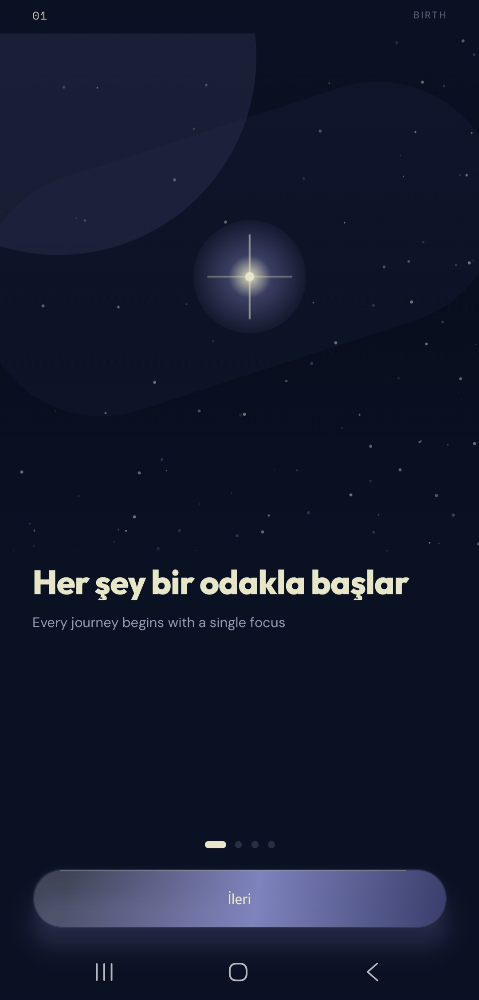
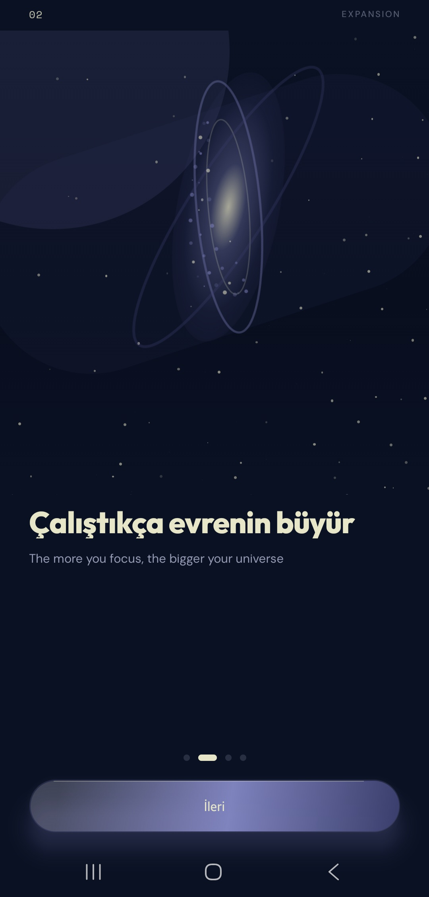

# Astrocus

Gamified odaklanma uygulaması — Future Talent 2026 bitirme projesi.

| | |
|---|---|
|  |  |

## Monorepo

| Dizin | Teknoloji |
|-------|-----------|
| [`frontend/`](frontend/) | Expo 54, React Native, TypeScript, Expo Router |
| [`backend/`](backend/) | Supabase (PostgreSQL + Auth + RLS), Node + Gemini |
| [`prodocs/`](prodocs/) | PRD, Plan, architecture, compliance |

## Özellikler

- Odak seansı, yıldız tozu, galaksi ilerlemesi
- Supabase Auth + RLS
- **Galaktik Tavsiyeler** (Gemini API, sunucu üzerinden)
- Gizlilik politikası ve hesap silme (store gereksinimi)

## Hızlı başlangıç

```bash
npm install

# frontend/.env ve backend/.env dosyalarını örneklerden oluşturun
cp frontend/.env.example frontend/.env
cp backend/.env.example backend/.env

# Supabase migration
cd backend
npx supabase link
npx supabase db push

# API
npm run dev:api

# Mobil (kök dizinden)
npm run dev:mobile
```

## Dokümantasyon

- [Kurulum](docs/SETUP.md)
- [Mimari](prodocs/architecture.md)
- [PRD özeti](prodocs/PRD.md)
- [İlerleme](progress.md)

## Lisans

MIT
