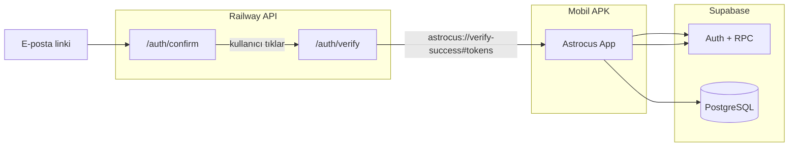

# Astrocus — Canlıya Geçiş Rehberi (baştan sona)

> **Son güncelleme:** 2026-06-11  
> Bu doküman, production hazırlığı sırasında yapılan tüm adımları, güncel yapılandırmayı ve test akışını tek yerde toplar.

İlgili dokümanlar:

| Konu | Dosya |
|------|--------|
| Kontrol listesi (özet tablo) | [release-checklist.md](./release-checklist.md) |
| Android APK/AAB (yerel) | [android-local-release.md](./android-local-release.md) |
| Backend Railway | [backend-deploy.md](./backend-deploy.md) |
| E-posta doğrulama + SMTP | [auth-email-templates.md](./auth-email-templates.md) |
| Google OAuth + SHA-1 | [google-oauth-setup.md](./google-oauth-setup.md) |
| FCM / push | [fcm-android-setup.md](./fcm-android-setup.md) |
| Expo Go geliştirme ağı | [dev-expo-go-networking.md](./dev-expo-go-networking.md) |

---

## 1. Genel bakış

Astrocus **Expo (React Native) + Supabase + Express API (Railway)** mimarisiyle çalışır. Production build’de:

- `APP_ENV=production` → cleartext HTTP kapalı, demo modu kapalı, production API URL’si
- Mobil → Supabase Auth + RPC (yıldız açma, seans kaydı vb.)
- Express API → e-posta doğrulama köprüsü (`/auth/confirm`, `/auth/verify`), analytics proxy, hesap silme
- Push → FCM (`google-services.json`) + `expo-notifications`



---

## 2. Ortam değişkenleri (güncel son hal)

### 2.1 `frontend/.env` (production)

```env
APP_ENV=production

EXPO_PUBLIC_SUPABASE_URL=https://YOUR_PROJECT.supabase.co
EXPO_PUBLIC_SUPABASE_ANON_KEY=your-anon-key

EXPO_PUBLIC_API_URL=https://astrocus.up.railway.app/

# Native deep link — Supabase Redirect URLs ile aynı olmalı
EXPO_PUBLIC_AUTH_RESET_REDIRECT_URI=astrocus://reset-password
EXPO_PUBLIC_AUTH_VERIFY_REDIRECT_URI=astrocus://verify-success

EXPO_PUBLIC_POSTHOG_KEY=phc_...
EXPO_PUBLIC_POSTHOG_HOST=https://eu.i.posthog.com

EXPO_PUBLIC_SENTRY_DSN=https://...@....ingest.de.sentry.io/...

EXPO_PUBLIC_GOOGLE_WEB_CLIENT_ID=....apps.googleusercontent.com
EXPO_PUBLIC_GOOGLE_ANDROID_CLIENT_ID=....apps.googleusercontent.com
```

**Önemli:**

| Değişken | Doğru değer | Yanlış (kullanma) |
|----------|--------------|-------------------|
| `EXPO_PUBLIC_AUTH_VERIFY_REDIRECT_URI` | `astrocus://verify-success` | `astrocus://verify-email` (rota yok) |
| `APP_ENV` | `production` | `development` (release build’de demo + localhost riski) |

`EXPO_PUBLIC_*` değerleri **release build sırasında bundle’a gömülür**. `.env` değiştirdikten sonra APK/AAB’yi **yeniden** al.

### 2.2 `backend/.env` (production)

```env
SUPABASE_URL=https://YOUR_PROJECT.supabase.co
SUPABASE_ANON_KEY=your-anon-key
SUPABASE_SERVICE_ROLE_KEY=your-service-role-key

APP_ENV=production
PORT=4000
HOST=0.0.0.0
ALLOWED_ORIGIN=false

# deploy:auth-email için (git’e commit etme)
SUPABASE_ACCESS_TOKEN=sbp_...
SUPABASE_PROJECT_REF=yunvuwcaxumhcyqppikn

SMTP_HOST=smtp.resend.com
SMTP_PORT=465
SMTP_USER=resend
SMTP_PASS=re_...
SMTP_ADMIN_EMAIL=astrocus@techsider.co
```

| Değişken | Production değeri | Açıklama |
|----------|-------------------|----------|
| `ALLOWED_ORIGIN` | `false` | Mobil-only; CORS kapalı (web istemcisi yoksa doğru) |
| `APP_ENV` | `production` | Sentry `enabled` için gerekli (`monitoring.ts`) |

### 2.3 EAS (`eas.json`)

`preview` ve `production` profilleri zaten `APP_ENV=production` set ediyor. Yerel release build için `scripts/build-release-apk.ps1` aynı değişkeni export eder.

---

## 3. Kod değişiklikleri (2026-06-11 oturumu)

### 3.1 UI düzeltmeleri

| Değişiklik | Dosya | Detay |
|------------|-------|--------|
| Onboarding “Başla” butonu | `src/screens/OnboardingScreen.tsx` | Renk `#7c3aed` → `colors.primary` (`#8387C3`, tema paleti) |
| Seans kaybedildi metni | `src/screens/SessionScreen.tsx` | Süre metni 20 sn → **10 sn** (`WARNING_THRESHOLD_SECONDS`, bildirimle uyumlu) |

### 3.2 Production / demo modu

| Değişiklik | Dosya | Detay |
|------------|-------|--------|
| Demo oturum yalnızca `__DEV__` | `src/context/auth/devDemo.ts` | `isDevDemoEnabled()`, production’da demo token temizlenir |
| Bootstrap temizliği | `src/context/AuthContext.tsx` | Eski `dev-demo:*` token’lar release’te silinir |
| `.env` varsayılanları | `frontend/.env.example`, `backend/.env.example` | `APP_ENV=production` |

### 3.3 E-posta doğrulama (süresi dolmuş hatası)

**Sorun:** Gmail/Outlook güvenlik tarayıcıları e-postadaki `/auth/verify` linkine otomatik istek atıp tek kullanımlık token’ı tüketiyordu.

**Çözüm:**

1. E-posta şablonu → `{{ .SiteURL }}/auth/confirm?token_hash=...` (token henüz tüketilmez)
2. `/auth/confirm` → kullanıcıya “E-postamı doğrula” düğmesi
3. Düğme → `/auth/verify` → `verifyOtp` → `astrocus://verify-success#access_token=...`
4. Uygulama `useDeepLink` ile oturumu kurar → `/verify-success`

| Dosya | Rol |
|-------|-----|
| `backend/src/routes/auth.routes.ts` | `GET /auth/confirm`, `GET /auth/verify` |
| `backend/supabase/templates/confirmation.html` | Link `/auth/confirm` |
| `backend/supabase/templates/recovery.html` | Link `/auth/confirm` |
| `backend/supabase/scripts/deploy-auth-email-config.mjs` | `.env` otomatik yükleme + SMTP deploy |

**Deploy sırası:**

```powershell
# 1) Backend’i Railway’e push et (yeni /auth/confirm route)
# 2) Şablonları Supabase’e yükle:
cd backend
npm run deploy:auth-email
```

Script `backend/.env` dosyasını okur (`SUPABASE_ACCESS_TOKEN`, `SUPABASE_PROJECT_REF`, SMTP).

### 3.4 Ölü kod temizliği

| Silinen | Neden |
|---------|--------|
| `src/components/StarfieldBackground.tsx` | Hiç import edilmiyordu; yerine `GalaxyBackground` (Skia) |
| `src/services/starsApi.ts` | Kullanılmıyordu; unlock Supabase RPC ile |

Kaldırılan ölü export’lar: `TabScreenTopBar`, `isDefaultUsername`, `GalaxyBackground` default export.

---

## 4. Adım adım — ilk production release

### Adım 0 — Önkoşullar

- [ ] Android Studio + JDK (`JAVA_HOME`)
- [ ] `frontend/google-services.json` (Firebase → `com.astrocus.app`) — **gitignore’da**, repoda görünmez
- [ ] `frontend/.env` ve `backend/.env` production değerleri dolu
- [ ] Railway backend canlı + `GET /health` → `{ ok: true }`

### Adım 1 — Supabase Auth ayarları

**Dashboard → Authentication → URL Configuration:**

| Alan | Değer |
|------|--------|
| Site URL | `https://astrocus.up.railway.app` |
| Redirect URLs | `astrocus://verify-success`, `astrocus://reset-password`, `astrocus://auth/callback`, `https://astrocus.up.railway.app/auth/mobile-redirect` |

**E-posta şablonları:**

```powershell
cd backend
npm run deploy:auth-email
```

Beklenen çıktı: `Auth e-posta + redirect ayarları güncellendi (OTP: 900 sn / 15 dk).`

### Adım 2 — Railway backend

1. GitHub’dan `backend/` deploy
2. Environment variables: `backend/.env.example` ile aynı set
3. `ALLOWED_ORIGIN=false`, `APP_ENV=production`
4. Redeploy sonrası test:

```bash
curl https://astrocus.up.railway.app/health
```

### Adım 3 — Google Sign-In

```powershell
cd frontend\android
.\gradlew.bat signingReport
```

`Variant: debug` SHA-1’i Google Cloud Console → Android client (`com.astrocus.app`) içine ekle. Yerel release build şimdilik debug keystore kullanır.

### Adım 4 — Android release build

`google-services.json` yeni eklendiyse veya değiştiyse:

```powershell
cd frontend
npx expo prebuild --platform android --clean
npm run android:release
```

Çıktı: `frontend/android/app/build/outputs/apk/release/app-release.apk`

Play Store için: `npm run android:bundle` → `app-release.aab`

### Adım 5 — Cihazda smoke test

Sırayla dene:

1. **Kayıt** → e-posta gelir → linke tıkla → `/auth/confirm` sayfası → düğme → uygulama açılır → `/verify-success`
2. **Onboarding** → takımyıldız seç
3. **Google ile giriş**
4. **Odak seansı** tamamla + kutlama
5. **Arka plan** → 10 sn uyarı / seans kaybı metni (ekranda “10 saniye”)
6. **Kilit ekranı** ongoing bildirimi (Android + FCM)
7. **Çıkış / tekrar giriş**
8. **Hesap silme** (isteğe bağlı test hesabı)

---

## 5. Sık karşılaşılan sorunlar

### “Bağlantının süresi dolmuş veya geçersiz”

| Kontrol | Çözüm |
|---------|--------|
| E-posta linki hâlâ `/auth/verify` mi? | `npm run deploy:auth-email` + yeni kayıt |
| Railway’de `/auth/confirm` yok | Backend redeploy |
| Site URL yanlış | Supabase → `https://astrocus.up.railway.app` |
| Eski e-posta | Yeni kayıt ile taze link dene |

### Google Sign-In `DEVELOPER_ERROR`

SHA-1 eksik veya yanlış keystore. `signingReport` ile doğru fingerprint’i ekle.

### Push bildirimi gelmiyor

- `google-services.json` var mı?
- `prebuild --clean` sonrası rebuild?
- Bildirim izni verildi mi?
- Expo Go **değil**, release APK kullan

### Demo giriş çalışmıyor (release’te)

Beklenen davranış. `demo` / `demo1234` yalnızca Metro `__DEV__` modunda.

---

## 6. Geliştirmeye geri dönüş

```env
# frontend/.env
APP_ENV=development
EXPO_PUBLIC_API_URL=http://192.168.x.x:4000
```

```powershell
cd frontend
npm run start:lan
```

Demo: `demo@astrocus.dev` / `demo1234` (yalnızca `__DEV__`).

---

## 7. Bilinçli kapsam dışı (v1)

- Expo Go production testi desteklenmez
- Apple Sign In Android’de gizli; iOS mağaza v2
- `backend/routes/stars.routes.ts` mobilde kullanılmıyor (unlock doğrudan Supabase RPC)
- OTA updates kapalı (`app.config.ts` → `updates.enabled: false`)

---

## 8. Hızlı komut özeti

```powershell
# E-posta şablonları → Supabase
cd backend
npm run deploy:auth-email

# Release APK
cd frontend
npm run android:release

# Tip kontrol
cd frontend
npm run typecheck

# Session testleri
cd frontend
npm run test:session
```
