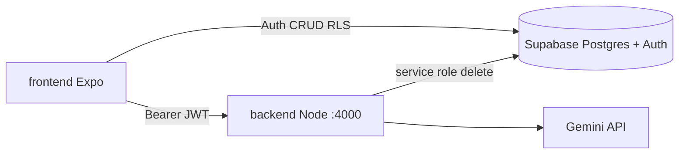

# Astrocus — Tech Stack

## Frontend (`frontend/`)

| Katman | Seçim | Gerekçe |
|--------|-------|---------|
| Framework | Expo SDK 54 + React Native | Cross-platform, Expo Go |
| Dil | TypeScript | Tip güvenliği |
| Routing | Expo Router | Dosya tabanlı route, deep link |
| State | React Context (Auth / Session / UI) | MVP için yeterli |
| Backend client | `@supabase/supabase-js` | Auth + Postgres RLS |
| Depolama | SecureStore + AsyncStorage | Token / tercih / offline kuyruk |

## Backend (`backend/`)

| Katman | Seçim | Gerekçe |
|--------|-------|---------|
| Veritabanı | Supabase PostgreSQL | Hosted Postgres, Auth, RLS |
| Şema | SQL migrations | `profiles`, `sessions`, `stardust_ledger` |
| API | Node.js + Express 5 | LLM proxy, hesap silme (service role) |
| LLM | Google Gemini (`@google/generative-ai`) | Galaktik Tavsiyeler |
| Doğrulama | Zod | İstek şemaları |

## AI kullanımı (ürün)

- **Çekirdek:** Seans sonrası kişiselleştirilmiş kısa motivasyon cümlesi
- **Akış:** Mobil → `POST /ai/galactic-advice` → Gemini → kutlama modalı
- **Güvenlik:** `GEMINI_API_KEY` yalnızca `backend/.env`

## AI kullanımı (geliştirme)

- Cursor + prodocs (`PRD`, `Plan`, `progress.md`)
- Kararlar `progress.md` dosyasına işlenir

## DevOps

- GitHub Actions: frontend + backend typecheck
- `.env.example` şablonları; gerçek anahtarlar commit edilmez


### Mimari

### Monorepo

```text
astrocus/
├── frontend/     Expo Router + React Native (TypeScript)
├── backend/      Node API (Gemini, hesap silme) + Supabase SQL
└── prodocs/      PRD, Plan, Progress, compliance
```

### Veri akışı



### Tablolar (Supabase)

| Tablo | Açıklama |
|-------|----------|
| `profiles` | Kullanıcı profili (`auth.users` 1:1) |
| `sessions` | Tamamlanan odak seansları |
| `stardust_ledger` | Yıldız tozu hareketleri |

**RPC:** `complete_focus_session` — seans + ledger + streak atomik.

**RLS:** Kullanıcı yalnızca kendi satırlarına erişir.

### AI — Galaktik Tavsiyeler

1. Seans tamamlanır (`complete_focus_session`).
2. Frontend `POST /ai/galactic-advice` (özet metrikler, dil).
3. Backend Gemini ile tek cümle üretir.
4. Kutlama modalında gösterilir.

API anahtarı: yalnızca `backend/.env` (`GEMINI_API_KEY`).

### Store uyumu

- `app/legal/privacy-policy` — gizlilik metni
- `app/legal/delete-account` — `POST /account/delete` + Supabase admin silme


### Repo Klasör Yapısı

| Klasör | Rol |
|--------|-----|
| `frontend/` | Expo mobil uygulama |
| `backend/` | Supabase migrations + Node API (Gemini, hesap silme) |
| `prodocs/` | Ders dokümanları |
| `docs/` | SETUP, QA, ekran görüntüleri |

### Çalıştırma

```bash
# Kök
npm install

# Mobil
npm run dev:mobile

# API (ayrı terminal)
npm run dev:api
```

Migration: `cd backend && npx supabase db push`
